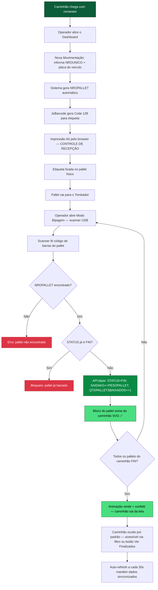

<p align="center">
  
</p>

<h1 align="center">DASH-MOV-RECEPCAO</h1>

<p align="center">
  <b>Dashboard Operacional — Movimentação de Saldos na Recepção de Frutos</b><br>
  Módulo: Recepção / Tombador<br>
  Sankhya ERP — Grupo Argo
</p>

<p align="center">
  
  
  
  
  
</p>

---

## 📋 Sobre

Dashboard operacional em tempo real para monitoramento da **movimentação de pallets e KG na recepção de frutos**, integrado ao ERP Sankhya via tabelas customizadas (`AD_ROMANEIOENTRMOVSALDO` / `AD_ROMANEIOENTR`).

O operador acompanha a entrada dos caminhões, gerencia pallets individualmente, bipa o código de barras no tombador com leitor USB e imprime etiquetas **CONTROLE DE RECEPÇÃO** (A5 portrait) diretamente pelo browser — tudo na mesma tela, sem troca de módulo.

### Problema resolvido

Anteriormente o controle de recepção era manual e fragmentado:
- Anotações em papel para contagem de pallets por caminhão
- Sem visibilidade em tempo real de saldo de KG por romaneio
- Bipagem no tombador feita fora do sistema, sem baixa automática
- Etiquetas impressas manualmente sem código de barras rastreável

Com este dashboard, **uma única tela** centraliza: entrada, baixa automática por scanner, status por pallet, stat cards agregados e impressão de etiquetas em lote.

---

## 📁 Estrutura do Projeto

```
Dash-movimentacao-recepcao-refugo/
├── primeiro_nivel.jsp                     ← Entry point — carregado pelo Sankhya
├── assets/
│   ├── css/
│   │   └── style.css                      ← Tema Dark Glassmorphism (CSS Variables)
│   └── js/
│       ├── config.js                      ← Constantes, mapeamentos e magic numbers
│       ├── dashboard.js                   ← Orquestrador principal (init + refresh + filtros)
│       └── modules/
│           ├── state.js                   ← Estado global da aplicação (Store)
│           ├── sanitizer.js              ← Sanitização com DOMPurify
│           ├── ui.js                      ← Toast, partículas, relógio, tema, sidebar
│           ├── api.js                     ← Chamadas ao Sankhya (CRUD + retry + filtros)
│           ├── renderer.js               ← Renderização visual (caminhões SVG, pallets, finalizados)
│           ├── modal.js                  ← Modais CRUD, bipagem e etiqueta A5
│           └── events.js                 ← Listeners, debounce e ações do usuário
└── README.md
```

---

## 🏗️ Arquitetura — Módulos JS

### Ordem obrigatória de carregamento

```
config.js → state.js → sanitizer.js → ui.js → api.js → renderer.js → modal.js → events.js → dashboard.js
```

| Módulo | Namespace Global | Responsabilidade |
|--------|-----------------|-----------------|
| `config.js` | `CONFIG` | Constantes, STATUS_MAP, BLOCK_COLORS, TOAST_ICONS, magic numbers |
| `state.js` | `Store` | Estado em memória: movimentações, romaneio atual, caminhão selecionado, filtros, controle de finalizados |
| `sanitizer.js` | `Sanitizer` | DOMPurify: `clean()`, `text()`, `number()`, `integer()` |
| `ui.js` | `UI` | Toast, partículas animadas, relógio, toggle tema, sidebar, confetti |
| `api.js` | `API` | `fetchResumo`, `fetchPallets`, `create`, `update`, `bipar`, `remove`, retry exponencial, filtros dinâmicos |
| `renderer.js` | `Renderer` | Caminhão SVG 3D, blocos de pallet, stat cards, cards de refugo, controle de finalizados |
| `modal.js` | `ModalInjector` | Modal CRUD (novo/editar), modal bipagem (scanner), modal impressão etiqueta A5 |
| `events.js` | `Events` | Debounce busca, bipagem, atalhos de teclado, refresh |
| `dashboard.js` | — | Init, `carregarDados`, `selecionarCaminhao`, filtros, detecção de finalizados |

### Stack de bibliotecas externas (CDN)

| Biblioteca | Versão | Uso |
|-----------|--------|-----|
| Bootstrap | 5.3.0 | Grid, modais, utilitários CSS |
| Font Awesome | 6.5.2 | Ícones |
| Inter (Google Fonts) | — | Tipografia |
| jQuery | 3.5.1 | DOM helpers legados |
| SweetAlert2 | 11 | Confirmações (delete) |
| AOS | 2.3.1 | Animações de entrada (scroll) |
| DOMPurify | 3.0.6 | Sanitização XSS |
| JsBarcode | 3.11.6 | Geração de código de barras Code 128 |
| canvas-confetti | 1.6.0 | Celebração ao finalizar caminhão |
| SankhyaJX | main | Bridge JS → Sankhya (`executeQuery`) |

---

## ⚙️ Configuração (`config.js`)

| Chave | Valor padrão | Descrição |
|-------|-------------|-----------|
| `ENTITY_NAME` | `AD_ROMANEIOENTRMOVSALDO` | Entidade principal do CRUD |
| `DATA_SET_ID` | `00P` | ID do DataSet Sankhya |
| `REFRESH_INTERVAL` | `30000` ms | Auto-refresh dos dados |
| `API_RETRY_COUNT` | `3` | Tentativas em caso de falha |
| `API_RETRY_DELAY` | `1000` ms | Delay base para backoff exponencial |
| `DEBOUNCE_DELAY` | `300` ms | Delay da busca por pallet |
| `PESO_PADRAO_PALLET` | `1000` KG | Peso pré-preenchido ao criar pallet |
| `MAX_SLOTS` | `30` | Slots máximos por caminhão no SVG |
| `TOAST_DURATION` | `3000` ms | Duração dos toasts |

### Mapeamentos de status

| Código DB | Label exibido | Cor |
|-----------|--------------|-----|
| `APR` | À PROCESSAR | `#60a5fa` (azul) |
| `EPR` | EM PROC. | `#ff8c1a` (laranja) |
| `FIN` | FINALIZADO | `#4ade80` (verde) |

---

## 🗃️ Tabelas Envolvidas

| Tabela | Operação | Descrição |
|--------|----------|-----------|
| `AD_ROMANEIOENTRMOVSALDO` | **READ / WRITE** | Movimentações por pallet (tabela principal) |
| `AD_ROMANEIOENTR` | **READ** | Cabeçalho do romaneio (romaneio, datas, produtor, área, mercado) |
| `TGFPAR` | **READ** | Parceiro/produtor (`NOMEPARC`) |
| `TGFPRO` | **READ** | Produto — JOIN para obter grupo do produto |
| `TGFGRU` | **READ** | Grupo do produto (`AD_DESCRESUMO` = variedade) |
| `AD_AREAPARCVW` | **READ** | Área do parceiro — área + válvula (`VALVLOTE`) |

### Campos principais de `AD_ROMANEIOENTRMOVSALDO`

| Campo | Tipo | Descrição |
|-------|------|-----------|
| `NROUNICO` | NUMBER | FK para romaneio — chave composta |
| `SEQUENCIA` | NUMBER | Sequência do pallet — chave composta |
| `NROPALLET` | VARCHAR | Código do pallet (ex: `16425-001`) |
| `PESOPALLET` | NUMBER | Peso em KG do pallet |
| `TIPOPALLET` | VARCHAR | `MP` / `REF` / `PA` |
| `ETAPA` | VARCHAR | `REC` / `EMB` / `EXP` |
| `STATUS` | VARCHAR | `APR` / `EPR` / `FIN` |
| `ENTRADAKG` | NUMBER | KG de entrada do pallet |
| `SAIDAKG` | NUMBER | KG de saída — atualizado automaticamente pela bipagem |
| `QTDPALLETSBAIXADOS` | NUMBER | Contador de baixas — atualizado automaticamente pela bipagem |
| `DHMOVIMENTACAO` | DATE | Data/hora da última movimentação |
| `NUMPCAMINHAO` | VARCHAR | Placa do veículo (ex: `HYT8D70`) |
| `OBS` | VARCHAR | Observação livre |

### Campos principais de `AD_ROMANEIOENTR` (cabeçalho — somente leitura)

| Campo | Uso |
|-------|-----|
| `ROMANEIO` | Número do romaneio exibido nos cards e etiqueta |
| `DTENTRADA` | Data de entrada — usada como filtro por período |
| `DTCOLHEITA` | Data de colheita — exibida na etiqueta |
| `TRATAMENTO` | Mercado (via `OPTION_LABEL`) |
| `UP` | Unidade produtiva |
| `CODPARC` | Código do produtor |
| `CODAREAP` | Código da área |
| `AD_QTD_CX_CONTENTORES` | Quantidade de contentores |
| `ORIGEMPESO` | `1` = Peso Roça / outros = Caixa Embalada |

---

## 🔄 Fluxo de Execução



---

## 🔍 Filtro de Pesquisa

A barra de filtro (abaixo da busca por pallet) permite consultar romaneios de outros dias ou pesquisar um romaneio específico.

| Filtro | Campo SQL | Comportamento |
|--------|-----------|---------------|
| **Nro. Único** | `MOV.NROUNICO = N` | Exibe somente o romaneio informado (inclui finalizados automaticamente) |
| **De / Até** | `TRUNC(ENT.DTENTRADA) BETWEEN d1 AND d2` | Exibe todos os romaneios com entrada no período |
| **Hoje** (reset) | `MOV.DHMOVIMENTACAO >= TRUNC(SYSDATE) OR IS NULL` | Volta ao comportamento padrão do dia atual |

> **Nota:** No modo "Hoje", o botão **Ver Finalizados** exibe apenas caminhões finalizados *hoje*. Caminhões de dias anteriores requerem filtro por período.

---

## 📊 Exemplo de Uso

### Cenário: Romaneio 16425 — 2 caminhões (HYT8D70 e ABC1234), 15 pallets cada

**Caminhão HYT8D70 — ao iniciar:**

| Seq | NROPALLET | Peso | Status |
|-----|-----------|------|--------|
| 1 | 16425-001 | 1.000 KG | À Processar |
| 2 | 16425-002 | 1.000 KG | À Processar |
| … | … | … | … |
| 15 | 16425-015 | 1.000 KG | À Processar |

**Stat cards ao selecionar o caminhão HYT8D70 — após bipagem de 6 pallets:**

| Card | Valor |
|------|-------|
| Entrada Recepção | 15.000 KG |
| Saída Recepção | 6.000 KG |
| Saldo Matéria Prima | 9.000 KG |
| Pallets Processados | 6 PLTS |

> Os stat cards refletem **somente o caminhão selecionado** ao clicar nele. Sem seleção, exibem o total do romaneio.

**Etiqueta A5 — campos exibidos:**
- Header: Logo Argo + CONTROLE DE RECEPÇÃO
- Romaneio / Mercado (OPTION_LABEL TRATAMENTO)
- Produtor (NOMEPARC) / Código do parceiro (CODPARC)
- Área + Válvula / UP / Data de Colheita
- Variedade / Modalidade (Peso Roça ou Caixa Embalada)
- Total Contentores / **Peso Caminhão** (soma ENTRADAKG do veículo)
- Data de Entrada / Placa Veículo
- Nº do pallet (20pt) + código de barras Code 128 + Romaneio (rodapé)

---

## 🚀 Deploy

### Pré-requisitos

- Sankhya ERP com acesso ao módulo JSP customizado
- Tabelas `AD_ROMANEIOENTRMOVSALDO` e `AD_ROMANEIOENTR` criadas no Oracle
- Campos customizados (`AD_QTD_CX_CONTENTORES`, `AD_DESCRESUMO` em `TGFGRU`, etc.) no Dicionário de Dados

### Passos

1. **Upload dos arquivos no Sankhya**
   - Copiar a pasta `assets/` e o arquivo `primeiro_nivel.jsp` para o diretório customizado do Sankhya
   - Garantir que `${BASE_FOLDER}` aponta para o diretório correto

2. **Configurar a tela no Sankhya**
   - Criar aba customizada apontando para `primeiro_nivel.jsp`
   - Configurar permissões de acesso por perfil de usuário

3. **Configurar impressão A5**
   - No diálogo de impressão do browser: Tamanho = **A5**, Margens = **Mínima**, Escala = **100%**
   - Não há dependência de impressora específica — qualquer impressora configurada no Windows

4. **Testar**
   - Abrir o dashboard e verificar os stat cards (deve mostrar `0 KG` se não houver movimentações do dia)
   - Criar uma nova movimentação e verificar geração do NROPALLET
   - Testar bipagem com scanner USB (envio de texto + Enter)
   - Imprimir etiqueta de teste e conferir layout A5
   - Bipar todos os pallets de um caminhão e verificar animação de finalização

---

## 📝 Observações

1. **Scanner USB como teclado:** O leitor Elgin Flash (e similares) funciona como dispositivo HID — envia o conteúdo do código de barras como texto + Enter. O modal de bipagem escuta o `keydown Enter` no input com `autofocus`.

2. **Etiqueta A5 portrait:** O CSS usa `@page { size: A5 portrait; margin: 5mm }` com `page-break-after: always` por etiqueta. O número do pallet é exibido em 20pt acima do barcode (JsBarcode com `displayValue: false`, height 60px).

3. **Retry com backoff exponencial:** Todas as chamadas à API Sankhya passam por `_fetchWithRetry` — 3 tentativas com delay de 1s, 2s, 4s antes de lançar erro.

4. **Sanitização XSS:** Todo dado externo (usuário ou API) é sanitizado via `Sanitizer.text()` / `Sanitizer.number()` antes de entrar no DOM ou ser gravado.

5. **NROPALLET auto-gerado:** Formato `{NROUNICO}-{SEQ_ZERO_PADDED}` — ex: `16425-003`. Sequência calculada com `COUNT(*) + 1` na tabela, por romaneio.

6. **Bipagem em lote:** A impressão de todas as etiquetas de um caminhão (`imprimirTodasEtiquetas`) pré-renderiza os SVGs no DOM oculto antes de abrir o popup, evitando bloqueio cross-origin do `document.write`.

7. **Auto-refresh:** O dashboard atualiza os dados a cada 30 segundos automaticamente. O botão de refresh manual anima o ícone de rotação enquanto carrega.

8. **Campos AUTO no formulário:** `SAIDAKG` e `QTDPALLETSBAIXADOS` são desabilitados no modal CRUD — são preenchidos automaticamente pela função de bipagem (`API.bipar`). O atributo `disabled` impede edição pelo usuário mas o valor ainda é lido pelo JavaScript.

9. **Controle de finalizados:** Caminhões com todos os pallets `STATUS=FIN` ficam ocultos por padrão. Ao serem finalizados em tempo real, exibem animação de saída (glow verde + slide) com confetti. O botão "Ver Finalizados" no filtro alterna a visibilidade. Filtros por período ou Nro. Único exibem finalizados automaticamente.

10. **Peso por caminhão na etiqueta:** O campo "Peso Caminhão" na etiqueta A5 soma o `ENTRADAKG` apenas dos pallets do veículo (NUMPCAMINHAO) sendo impresso — não do romaneio inteiro.

---

## 📜 Changelog

| Versão | Data | Tipo | Descrição |
|--------|------|------|-----------|
| 1.0.0 | 2026-04-01 | `feat` | Dashboard base: stat cards, sidebar, topbar, tema dark glassmorphism |
| 1.1.0 | 2026-04-10 | `feat` | Visualização de pallets por caminhão (grid 2D) |
| 2.0.0 | 2026-05-05 | `feat` | Caminhão SVG 3D com CSS Transforms e seleção por caminhão |
| 2.1.0 | 2026-05-10 | `feat` | Bipagem automática via scanner USB — baixa STATUS=FIN + SAIDAKG |
| 2.1.1 | 2026-05-10 | `fix` | STATUS corrigido de EPR para FIN na bipagem |
| 2.2.0 | 2026-05-11 | `feat` | Etiqueta CONTROLE DE RECEPÇÃO — Code 128, layout A5 portrait |
| 2.2.1 | 2026-05-11 | `fix` | Impressão em lote: SVGs pré-renderizados no DOM (sem bloqueio cross-origin) |
| 2.3.0 | 2026-05-11 | `feat` | NROPALLET auto-gerado por romaneio no formato `{NROUNICO}-{001}` |
| 2.3.1 | 2026-05-11 | `refactor` | Segurança: DOMPurify, debounce 300ms, retry exponencial, magic numbers centralizados |
| 2.4.0 | 2026-05-12 | `refactor` | Remoção de campos obsoletos (SALDORECEPKG, QTDPALLETSMP, SALDOPALLETS, EMBALAGEMIKG, EMBALAGEMMEKG, REFUGOKG) |
| 2.4.1 | 2026-05-12 | `feat` | NUMPCAMINHAO migrado de número para placa de veículo (VARCHAR) |
| 2.4.2 | 2026-05-12 | `feat` | Etiqueta redesenhada para A5 portrait — novos campos: mercado, área/válvula, contentores, modalidade |
| 2.4.3 | 2026-05-12 | `fix` | fetchCabecalhoRomaneio reescrito — joins via TGFPAR, TGFGRU, AD_AREAPARCVW (removido TSIEMP/TSIEND/TSICID/TSIUFS/TSIBAI) |
| 2.5.0 | 2026-05-12 | `feat` | Filtro por período (De/Até) e por Nro. Único com SQL BETWEEN na DTENTRADA |
| 2.5.1 | 2026-05-12 | `feat` | Controle de finalizados: animação de saída, badge "Ver Finalizados", ocultação automática |
| 2.5.2 | 2026-05-12 | `fix` | Peso na etiqueta corrigido para total por caminhão (NUMPCAMINHAO), não por romaneio |

---

## 👤 Autor

| | |
|---|---|
| **Desenvolvedor** | Natanael Lopes — Grupo Argo (Argo Fruta) |
| **Módulo** | Recepção / Tombador — Sankhya ERP |
| **Contato** | natanael.lopes@argofruta.com |

---

<p align="center">
  
  <br>
  <sub>Grupo Argo — Desenvolvimento ERP Sankhya</sub>
</p>
